# Food Ordering App Android

## Introduction
This App is created with goal to practice and lean android development. This is app is made as per the Internshala problem statement. APIs are provided by Internshala.
See below for more information.

## Technologies & Architecture 

#### Technologies
Android, Kotlin

#### Architecture Components
[ViewModel](https://developer.android.com/topic/libraries/architecture/viewmodel), [LiveData](https://developer.android.com/topic/libraries/architecture/livedata), [DataBinding](https://developer.android.com/topic/libraries/data-binding), 
[Navigation](https://developer.android.com/guide/navigation/)

#### External libraries 
[Volley](https://google.github.io/volley/) library for network call, 
[Picasso](https://square.github.io/picasso/) library for image processing 

## Features

**Login:** Login/create account/forgot password

**Restaurants:** List of restaurants from api call 

**Favorite Restaurants:** Restaurant can be added to favorites and will be stored in local database

**Sort:** Sort list of restaurants based on cost or rating

**Menu:** List of food items 

**Add to cart:** place order from cart 

**Order History:** History of Orders with data and time

**Profile:** Show Credentials used while Creating accounts 

## Screenshots

### Login | Register | Forget Password

  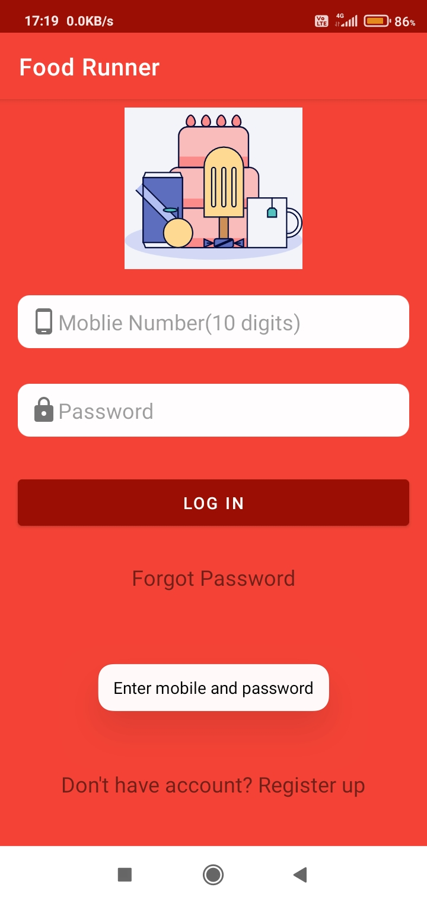    
  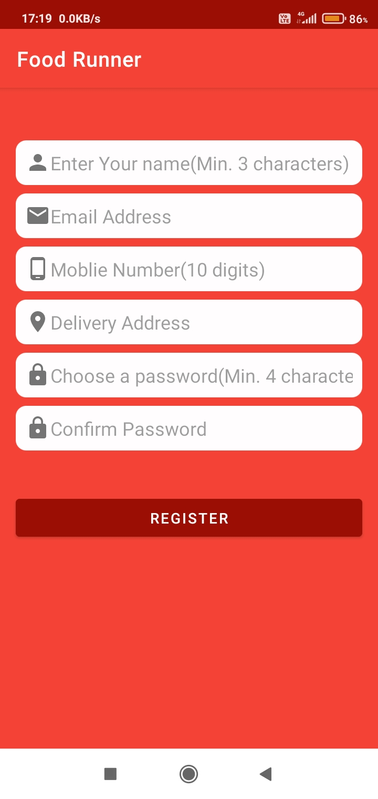    
  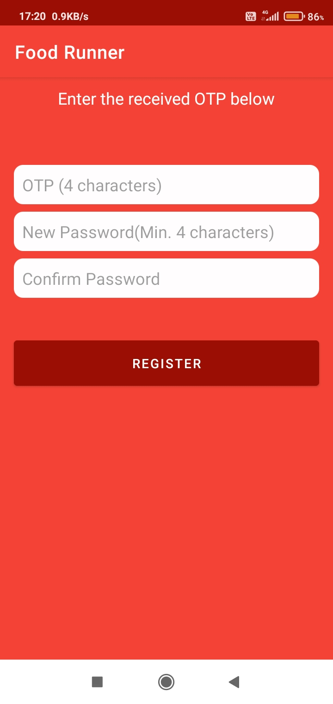    

### Navigation Drawer | All Restaurants | Menu 

  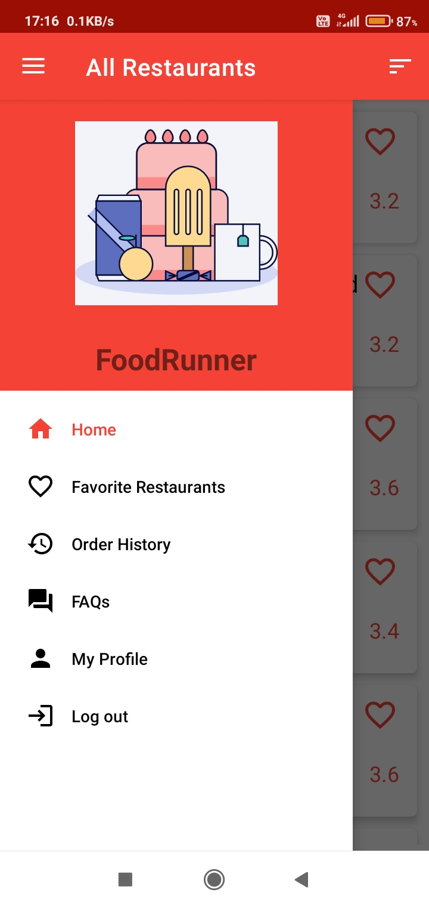    
  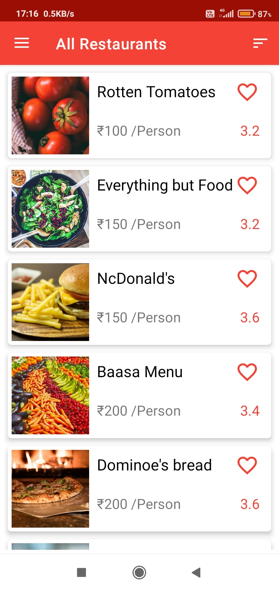    
  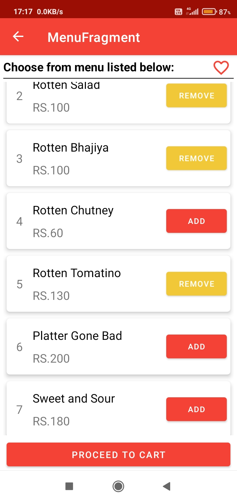    

### Sort | Favorites Restaurant | Order History 

  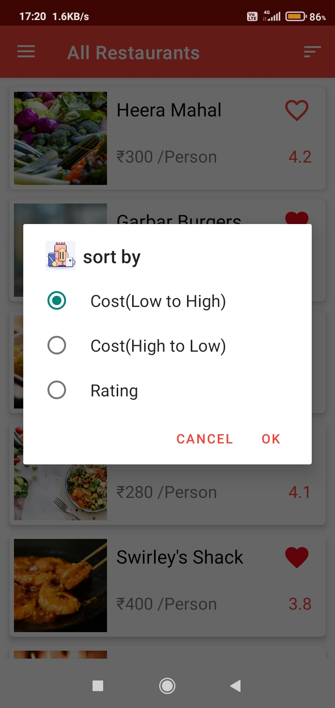    
  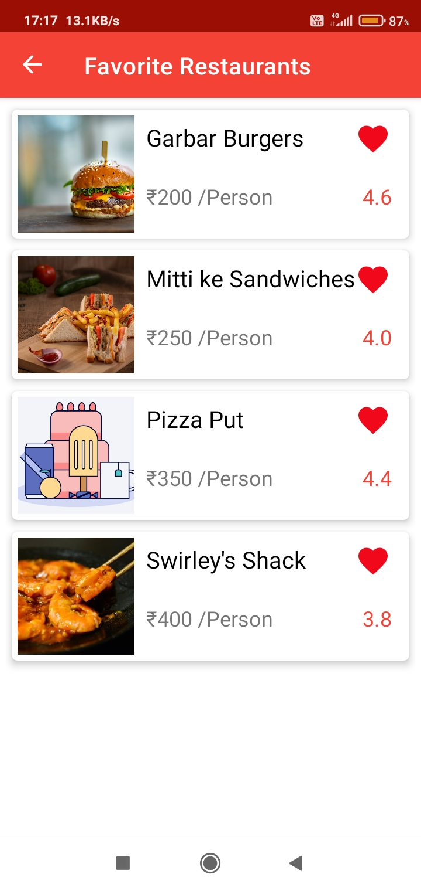    
  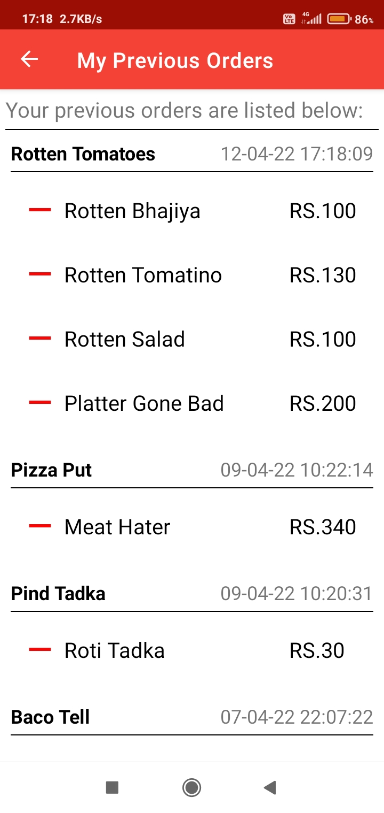    

### Sort | Favorites Restaurant | Order History 

      
      
      

### Profile | My Cart | FAQ 

  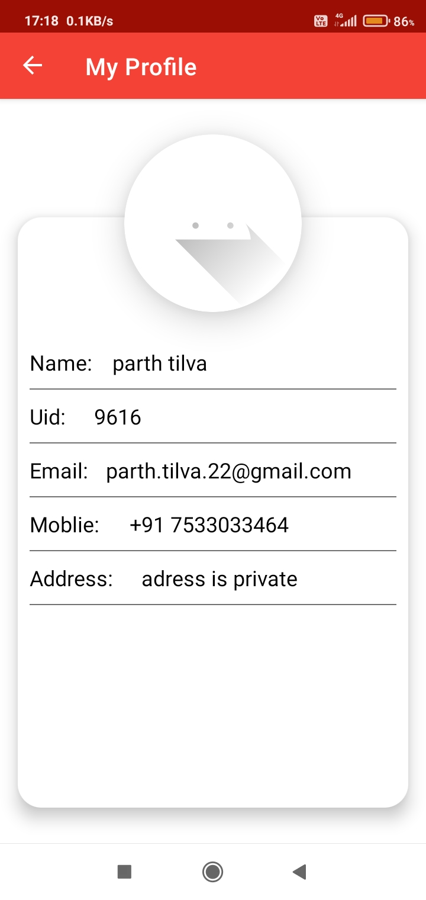    
  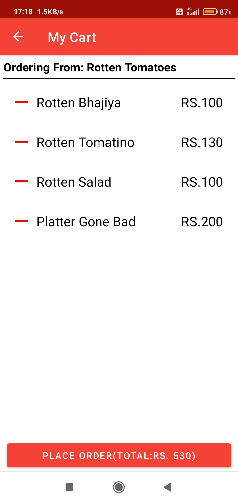    
  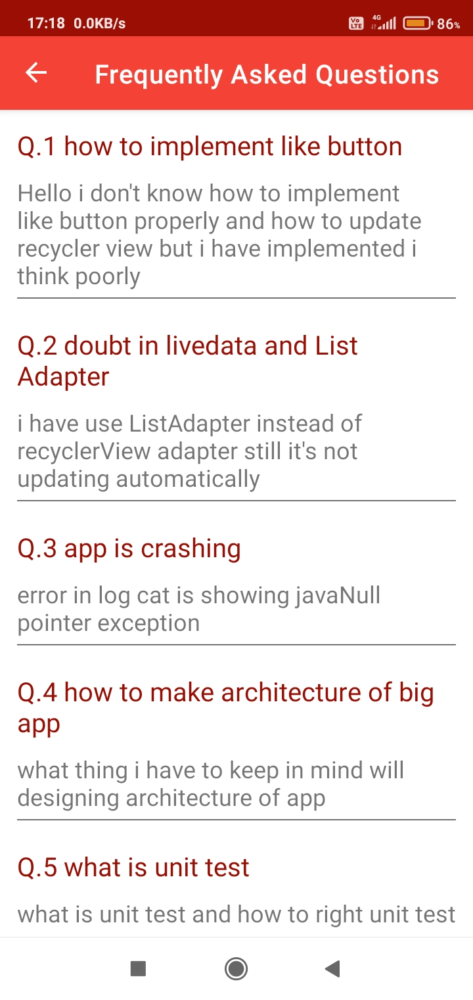    

